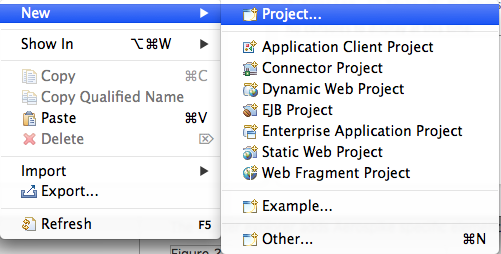
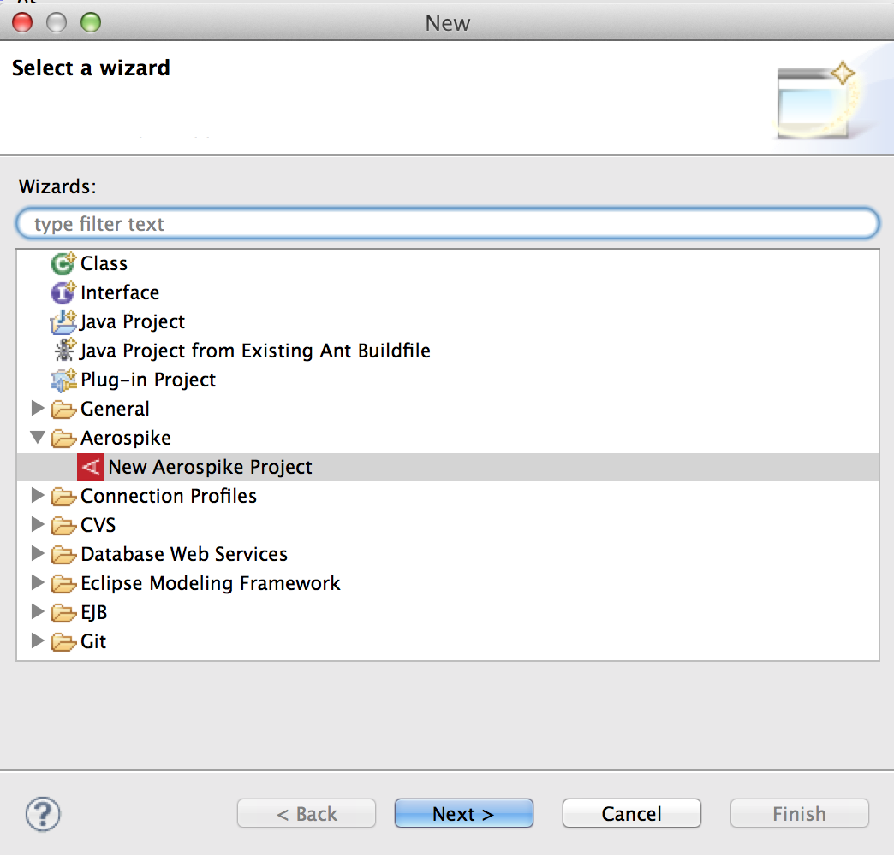
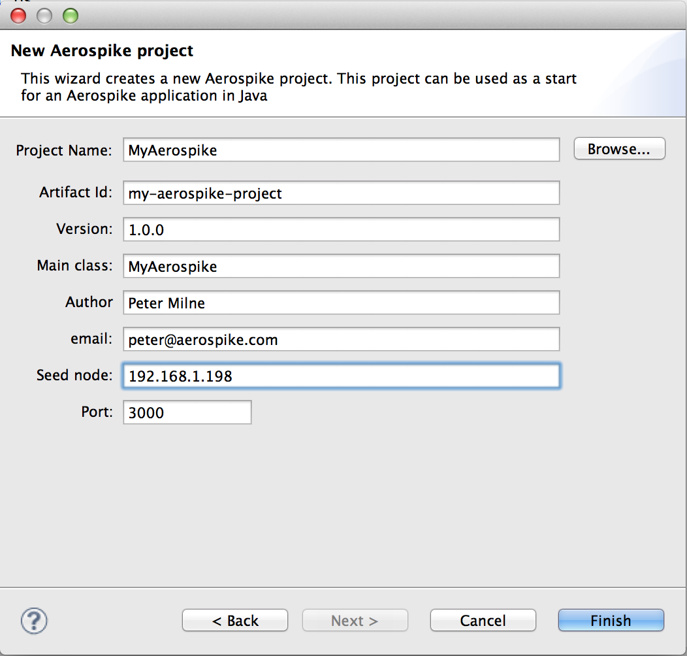
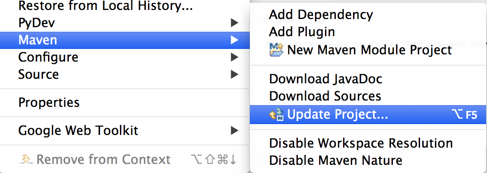
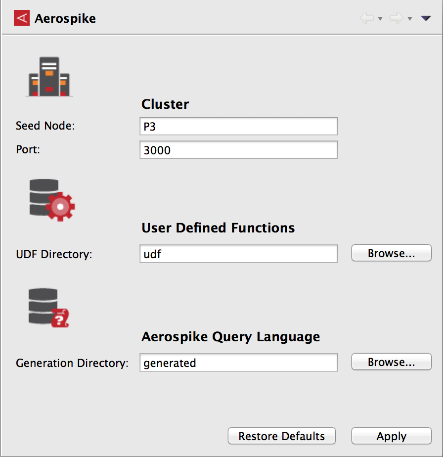
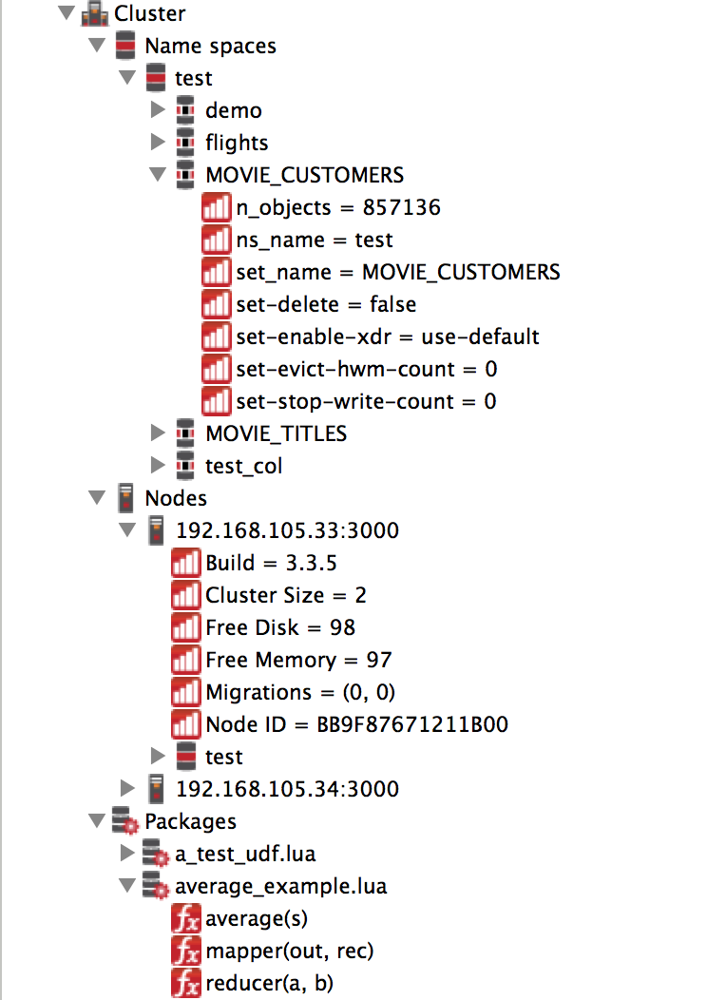
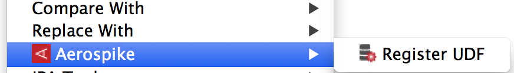
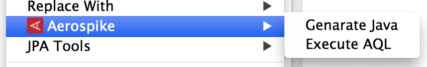
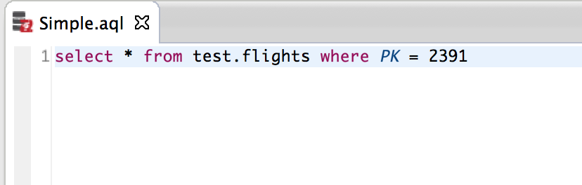
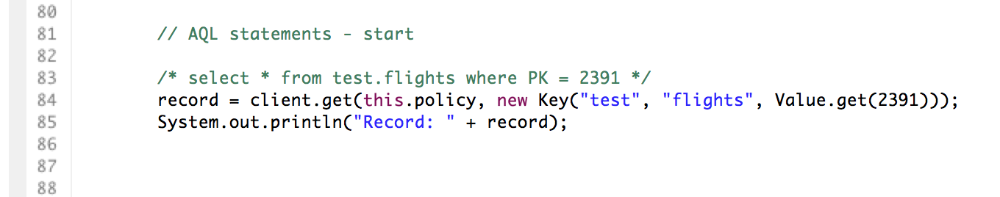

This Aerospike Toolkit makes it easier for Java developers using Eclipse IDE in incorporating Aerospike functionality into their applications.

The toolkit currently includes:

* Aerospike Java Project wizard
* Cluster Explorer
* User Defined Function (UDF) Registration
* Aerospike Query Language (AQL)
	* AQL specific editor
	* Query execution
	* Code generation
	
# Installation

**Eclipse Java EE IDE for Web Developers:**

* Click `Help >> Install New Software...`
* For 'Work with' enter:  https://github.com/aerospike/eclipse-tools/raw/master/aerospike-site
* Check `Aerospike` checkbox
* Click `Next` and complete installation process - this step requires you to restart Eclipse 

**Eclipse Workbench Developers:**

Follow these instructions to [Add Update Site](http://help.eclipse.org/kepler/index.jsp?topic=/org.eclipse.platform.doc.user/tasks/tasks-127.htm) to your  environment.

# Aerospike Java Project wizard

Prerequisites:

* Java Development Toolkit (JDT)
* Maven

This wizard will help you generate a starter Java project that uses Aerospike.To generate a new Aerospike Java project:

Click `File >> New >> Project`

 Project" width="50%" height="50%"/>

The New Project dialog will be displayed



Expand `Aerospike` category, then select `New Aerospike Project` and click `Next`


The New Aerospike project wizard will be displayed with Aerospike properties to be filled



* **Project Name** - Name of your Eclipse project -- this will also be set as the Maven project name
* **Artifact ID** - Maven artifact ID
* **Version** - Maven version
* **Main Class** - Name of the main Java class
* **Author** - Project author in Maven POM
* **email** - Email address of the author in Maven POM
* **Seed Node** - IP address of any one of the nodes in the Aerospike cluster. This will be stored in the projects persistent properties and is used for connections to the Aerospike cluster.
* **Port** - Port used by the seed node

Click `Finish`

After the project is generated, right-click on the project in Package Explorer and update the Maven project. This will download the required Maven dependencies and rebuild the project.



# Cluster Explorer

The cluster connection details, of seed node and port, are stored in persistent properties attached to the project. 


 
* **Seed Node** - IP address of any one of the nodes in the Aerospike cluster. This will be stored in the projects persistent properties and is used for connections to the Aerospike cluster.
* **Port** - Port used by the seed node
* **UDF Directory** - Directory where the User Defined Function are stored. This directory is relative to the project root. The local client will look for UDFs here.
* **Generation Directory** - Directory where the source code will be generated from AQL.

The Cluster Explorer adds Aerospike specific elements to the Explorer tree:



**Note:**
These extensions are not visible in the Java Package Explorer (JDT limitation)

# User Defined Function (UDF) Registration

User Defined Functions need to be registered with the cluster before they are available for use. During development, you may need to frequently register UDF packages with your development cluster as you make additions and modifications.

To register, in Package Explorer right-click on the Lua file containing the UDF package. Select `Aerospike` >> `Register UDF`



The UDF package will be registered with the cluster configured in the `Properties` page.


# Aerospike Query Language
Aerospike Query Language (aql) is an SQL-like language that is specific to Aerospike, it is easy to learn because of its similarity to SQL 

## AQL Editor
The AQL editor provides color syntax highlighting of the language elements, plus error checking when the AQL file is saved.

## Query Execution
An AQL file can be directly executed on the cluster configured.
Right-click on the aql file and select `Execute AQL`. The output from the cluster will be displayed in the console view.



## Code Generation
You can translate the AQL statements int the semantic equivalent Java code. To generate a Java class, Right-click on `Generate Java`. A new class, with the same name as the AQL file, will be generated and stored in the `Generation` folder. The location of this folder is configured in the Aerospike properties.

This AQL code: 



Will generate this Java code:




The class is immediately runnable, and it can be a start to build on.

# Source Code

The source code is available on GitHub at: https://github.com/aerospike/eclipse-tools

```bash
git clone https://github.com/aerospike/eclipse-tools.git
```


