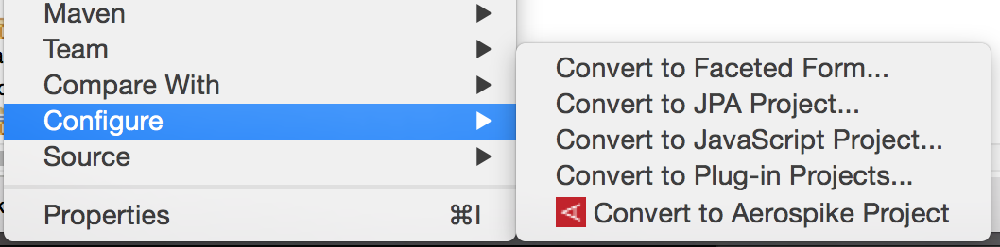

This Aerospike Toolkit makes it easier for Java developers using Eclipse IDE in incorporating Aerospike functionality into their applications.

The toolkit currently includes:

* Aerospike Java Project wizard
* User Defined Function (UDF) module Registration/Deregistration
* Aerospike Query Language (AQL) Tools
	* AQL Editor
	* Query Execution
	* Code Generation
* Cluster Explorer to browse
	* Namespaces
	* Sets
	* Nodes
	* UDF Modules and functions
	
# Installation

**Eclipse Java EE IDE for Web Developers:**

* Click `Help >> Install New Software...`
* For 'Work with' enter:  https://github.com/aerospike/eclipse-tools/raw/master/aerospike-site
* Check `Aerospike` checkbox
* Click `Next` and complete installation process - this step requires you to restart Eclipse 

**Eclipse Workbench Developers:**

Follow these instructions to [Add Update Site](http://help.eclipse.org/kepler/index.jsp?topic=/org.eclipse.platform.doc.user/tasks/tasks-127.htm) to your  environment.

# Aerospike Java Project wizard

Prerequisites:

* Java Development Toolkit (JDT)
* Maven

This wizard will help you generate a starter Java project that uses Aerospike.To generate a new Aerospike Java project:

Click `File >> New >> Project`

 Project" width="50%" height="50%"/>

The New Project dialog will be displayed


Expand `Aerospike` category, then select `New Aerospike Project` and click `Next`


The New Aerospike project wizard will be displayed.


Where:

* **Project Name** - Name of your Eclipse project -- this will also be set as the Maven project name
* **Artifact ID** - Maven artifact ID
* **Version** - Maven version
* **Main Class** - Name of the main Java class
* **Author** - Project author in Maven POM
* **email** - Email address of the author in Maven POM
* **Seed Node** - IP address of any one of the nodes in the Aerospike cluster. This will be stored in the projects persistent properties and is used for connections to the Aerospike cluster.
* **Port** - Port used by the seed node

After filling in the properties, click `Finish`. Once the project is generated, right-click on the project in Package Explorer and update the Maven project. This will download the required Maven dependencies and rebuild the project.


# User Defined Function (UDF) Registration

User Defined Functions need to be registered with the cluster before they are available for use. During development, this tool will make it easy for you to  register UDF modules with your development cluster as you make frequent additions and modifications to them.

**Usage**: In Package Explorer, right-click on the Lua (.lua) file containing  UDF package. Then select `Aerospike` >> `Register UDF`


If you do not see the Aerospike option, you will need to convert your project to an Aerospike project. Right click on the project in Package Explorer, select `Configure` >> `Convert to Aerospike Project`



The UDF module will be registered with the cluster configured in Aerospike properties -- see Cluster Explorer.

A registered module can be deregistered from the cluster explorer. 
**Usage**: In Cluster Explorer, right-click on the UDF Module. Then select `Deregister UDF`

# Aerospike Query Language Tools
Aerospike Query Language (aql) is a SQL-like language made available for database, UDF and index management operations. AQL is easy to learn because of its similarity to SQL.

The three tools include are:

* AQL Editor
* Query Execution
* Code Generation

## AQL Editor
The AQL Editor provides color syntax highlighting of the language elements and error checking when the AQL file is saved.

## Query Execution
An AQL file can be executed directly on the cluster configured.
Right-click on the AQL file and select `Aerospike` >> `Execute AQL`. The output from the cluster will be displayed in the console view.


## Code Generation
This tool lets you generate executable Java code from AQL statements. 

**Usage**: In Package Explorer, right-click on the AQL (.aql) file containing AQL statements. Then select `Aerospike` >> `Generate Java`. A new class, with the same name as the AQL file, will be generated and stored in the `generated` folder. The location of this folder is configured in Aerospike properties -- see Cluster Explorer.

For example, this AQL code: 

```aql
select FL_DATE_BIN from bar.flights where PK = 5000
```

Generates this Java code:

```java
record = client.get(this.policy, new Key("bar", "flights", Value.get(5000)), "FL_DATE_BIN");
```

# Cluster Explorer

The Cluster Explorer lets you easily view and edit Aerospike properties pertaining to the project. These properties include cluster connection details, UDF directory where Lua (.lua) files are stored and the directory where AQL Code Generation tool will store the generated Java class file(s).

To view the Cluster Explorer, select `Window` >> `Show View` >> `Project Explorer` and expand your project. You should see `Cluster` -- right-click on it and select `Properties` to view and edit 

If you do not see the Aerospike option, you will need to convert your project to an Aerospike project. Right click on the project in Package Explorer, select `Configure` >> `Convert to Aerospike Project`


**Note**: Due to Eclipse limitations, Cluster Explorer will not be visible in the Java Package Explorer.


 
 Where:

* **Seed Node** - IP address of any one of the nodes in the Aerospike cluster. This will be stored in the projects persistent properties and is used for connections to the Aerospike cluster.
* **Port** - Port used by the seed node
* **UDF Directory** - Directory where Lua (.lua) are stored. This directory is relative to the project root. The local client will look for UDFs here.
* **Generation Directory** - Directory where the source code will be generated from AQL. This directory is relative to the project root.

The Cluster Explorer adds Aerospike specific elements to the Project Explorer tree:


I