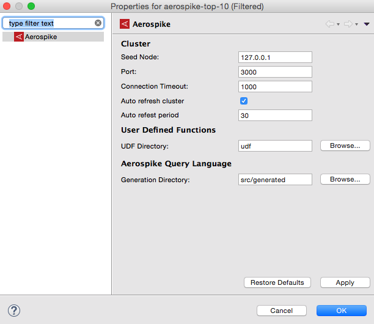
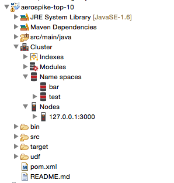

The Aerospike Developer's Toolkit provides the developer with facilities that aid in developing applications that use Aerospike.

These are:
* Cluster Explorer
* User Defined Function (UDF) registration
* Aerospike Query Language (AQL)
	* AQL specific editor
	* Query execution
	* Code generation
	

# Installation
The update site for the this plugin is located at: https://github.com/aerospike/eclipse-tools/raw/master/aerospike-site 

Follow these instructions to [Add Update Site](http://help.eclipse.org/kepler/index.jsp?topic=/org.eclipse.platform.doc.user/tasks/tasks-127.htm) to you Eclipse environment.

# Cluster Explorer

The cluster connection details, of seed node and port, are stored in persistent properties attached to the project. 


 

These properties also store the location of UDF modules, and the output directory of generated code.

The cluster explorer adds Aerospike specific elements to the Explorer tree:


		
**Note:**
These extensions are not visible in the Java Package Explorer (JDT limitation)


# User Defined Functions (UDFs)

User Defined Function need to be registered with the cluster before they are available for use. During development, you may need to frequently register UDF packages with your development cluster as you make additions and modifications.

To do this, simply right-click, in the Explorer, on the Lua file containing the UDF package. Select the popup menu `Register UDF`


The UDF package will be registered with the cluster configured in the `Properties` page.


# Aerospike Query Language
Aerospike Query Language (aql) is an SQL-like language that is specific to Aerospike, it is easy to learn because of its similarity to SQL 

## AQL Editor
The AQL editor provides color syntax highlighting of the language elements, plus error checking when the AQL file is saved.

## Query Execution
An AQL file can be directly executed on the cluster configured.
Right-click on the aql file and select `Execute AQL`. The output from the cluster will be displayed in the console view.


## Code Generation
You can translate the AQL statements int the semantic equivalent Java code. To generate a Java class, Right-click on `Generate Java`. A new class, with the same name as the AQL file, will be generated and stored in the `Generation` folder. The location of this folder is configured in the Aerospike properties.

This AQL code: 


Will generate this Java code:


The class is immediately runnable, and it can be a start to build on.

# Source Code

The source code is available on GitHub at: https://github.com/aerospike/eclipse-tools

```bash
git clone https://github.com/aerospike/eclipse-tools.git
```
##Build Instructions
Run the ANT script to build the Aerospike Feature.

```
ant -f build_feature.xml
``` 
the output will be in the `target` directory.


